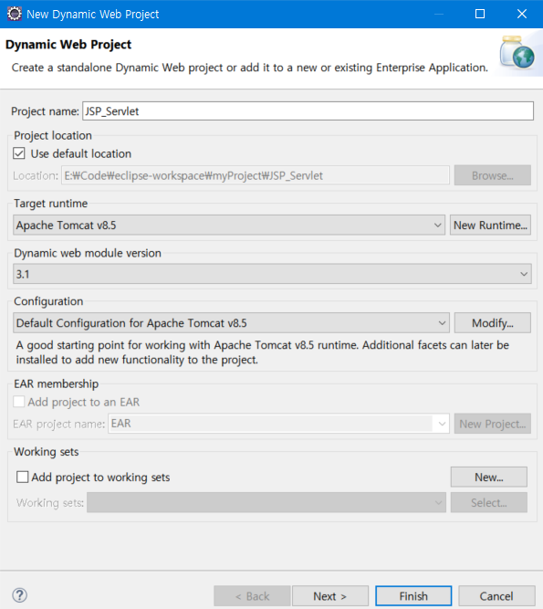
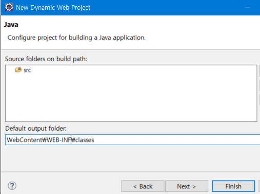
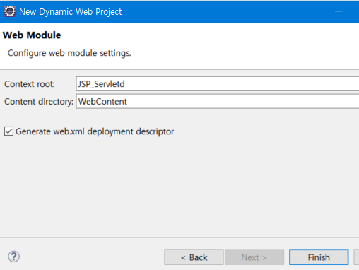
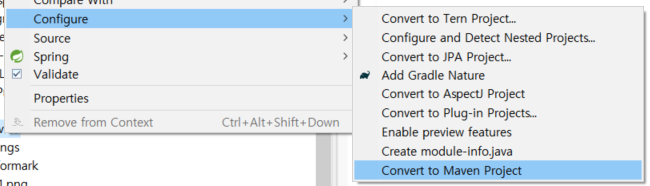

# JSP-Servlet

### 개발환경
+ Open JDK11 / Apache Tomcat 8.5
+ 이클립스 IDE

## INIT 
---

### **New Dynamic Web Project 로 프로젝트 생성** 

+  

+  

+  

+ ### **Maven 프로젝트로 변경**

  

+ pom.xml 에 servlet-jsp 관련 dependencies 추가

```xml
<project xmlns="http://maven.apache.org/POM/4.0.0" xmlns:xsi="http://www.w3.org/2001/XMLSchema-instance" xsi:schemaLocation="http://maven.apache.org/POM/4.0.0 https://maven.apache.org/xsd/maven-4.0.0.xsd">
<modelVersion>4.0.0</modelVersion>
<groupId>JSP_Servlet</groupId>
<artifactId>JSP_Servlet</artifactId>
<version>0.0.1-SNAPSHOT</version>
<packaging>war</packaging>
  
<dependencies>
  <!-- Servlet -->
  <dependency>
    <groupId>javax.servlet</groupId>
    <artifactId>servlet-api</artifactId>
    <version>2.5</version>
    <scope>provided</scope>
  </dependency>
  <dependency>
    <groupId>javax.servlet.jsp</groupId>
    <artifactId>jsp-api</artifactId>
    <version>2.1</version>
    <scope>provided</scope>
  </dependency>
  <dependency>
    <groupId>javax.servlet</groupId>
    <artifactId>jstl</artifactId>
    <version>1.2</version>
  </dependency>
</dependencies>	
	
<build>
  <sourceDirectory>src</sourceDirectory>
  <plugins>
    <plugin>
      <artifactId>maven-compiler-plugin</artifactId>
      <version>3.8.1</version>
      <configuration>
        <release>11</release>
      </configuration>
    </plugin>
    <plugin>
      <artifactId>maven-war-plugin</artifactId>
      <version>3.2.3</version>
      <configuration>
        <warSourceDirectory>WebContent</warSourceDirectory>
      </configuration>
    </plugin>
  </plugins>
</build>

</project>
```

## STEP 01. Servlet/JSP Basic

---

+ **Servlet**

> 서블릿이란, 웹 서비스를 위한 자바클래스를 말하며 자바를 사용해 웹을 만들기 위해 필요한 기술로 javax.servlet.http.httpServlet 클래스를 상속받는다.
다시 말해 기존의 java파일에 웹 페이지 구현을 위한 html이 들어간 구조라고 볼 수 있다.
클라이언트의 요청을 처리하고 그 결과를 HTML을 사용하여 요청에 대한 응답을 다시 클라이언트에게 전송하는 구현 규칙이 있다.
단, HTML 변경 시 servlet을 재 컴파일해야한다는 단점이 있다.

  + Servlet - 1 : **GET방식**
    > GET방식은 URL에 변수(데이터)를 포함시켜 요청하는 것으로 보안 유지가 불가능하다. 따라서 로그인 같은 경우 get방식이 부적합하다. GET방식에서 데이터를 header에 포함하여 전송하는데 Body는 보통 빈 상태로 전송되며 header 내용 중 body의 데이터를 설명하는 Content-Type 헤더필드도 들어가지 않는다. header에 데이터가 들어가기 떄문에 전송하는 길이에 제한이 있으며 초과 데이터는 절단된다. 캐싱이 가능하다.

  + Servlet - 2 : **Post방식**
    > POST방식은 URL에 변수(데이터)를 노출하지 않고 요청하는 것으로 보안 유지가 가능하다. 데이터를 body에 포함하여 전송하므로 body의 데이터를 설명하는 Content-Type헤더필드가 들어가고 어떤 타입인지 명시해줘야하 한다. Body에 데이터가 들어가 전송 길이는 제한이 없지만 요청 받는 시간(Time Out) 이 존재해 페이지 요청,기다리는 시간이 잆다. URL에 데이터가 노출되지 않아 캐싱이 불가능하다.

  + Servlet - 3 
    > 서블릿은 화면에 포현될 html코드를 프로그램적으로 작성한다. 이것으로 생기는 단점은 비즈니스 로직과 화면 구현 디자인이 같이 있어 가독성이 떨어지고 개발이 어렵다. 이러한 구조는 협업을 중요하게 생각하는 개발자들의 입장에서는 좋지 않은 코드이므로 비즈니스 로직과 디자인은 분리되는 것이 좋다. 또한 html파일 수정 시 서버를 재시동해야하고 html에는 서버에서 얻어온 정보를 동적으로 반영하기 어렵다.


+ **ServeltMapping 방법**

  + **Web.xml 을 이용한 방법**
  ```xml
  <!-- servlet 매핑 (web.xml파일을 이용한 방법) -->
  <servlet>
    <servlet-name>ServletController</servlet-name>
    <servlet-class>home.controller.ServletController</servlet-class>
  </servlet>

  <!-- url이 들어왔을때 어떤 servlet 과 mapping을 할지에 대한 정보  -->
  <servlet-mapping>
    <servlet-name>ServletController</servlet-name>
    <url-pattern>/Servlet.ho</url-pattern>
  </servlet-mapping>
  ```

  + **@WebServlet 어노테이션을 이용한 방법**
  ```java
    @WebServlet("/Servlet.ho")
  public class ServletController extends HttpServlet {
    private static final long serialVersionUID = 1L;
      public ServletController() {  }

    protected void doGet(HttpServletRequest request, HttpServletResponse response) throws ServletException, IOException {
      String page ="views/servlet.jsp";
      RequestDispatcher view = request.getRequestDispatcher(page);
      view.forward(request, response);
    }

    protected void doPost(HttpServletRequest request, HttpServletResponse response) throws ServletException, IOException {
      doGet(request, response);
    }
  }
  ```

+ **JSP** 
>JSP(Java Server Page)란, Java코드(<% %> 또는 <%= %>)가 들어가있는 HTML코드를 말하며 서블릿의 복잡함을 좀 더 간단하게 사용할 수 있다.
서블릿보다 쉽고 작성하기 빠른 것이 가장 큰 장점이며 디자인 부분(html)과 로직 부분(java)을 분리시킬 수 있다.
프로그래머가 직접 코딩한 서블릿보다 최적화 된 서블릿으로 생성시켜주므로 효율적인 코드가 만들어지며 JavaBean의 사용이 쉽다.
웹 애플리케이션 상에서 변수의 사용 가능한 범위 설정이 쉽다.

 + JSP1 :
    >스크립팅 원소(scripting element)는 JSP페이지에서 자바코드를 직접 기술할 수 있게 하는 기능이다. 선언문은 '<%! 자바코드 %>'로 표현하고 멤버변수와 메소드를 선언하기 위해 사용한다. 스크립틀릿 '<% %>'로 표현하고 JSP에서 자바코드를 사용하기 위해 사용한다. 표현식은 '<%= %>'로 표현하고 자바에서 작성한 값을 출력하기 위해 사용한다. JSP에서 주석은'<%-- --%>'로 표현한다.
    
    ```jsp
    <body>
    <!-- HTML 주석입니다. -->
    <%-- JSP 주석입니다. --%>
    <%--두 주석의 차이를 적어보자 --%>
    <%-- 차이 : HTML 주석은 페이지 소스보기나 F12로 확인가능하지만(클라이언트에게 전달이 되기 때문) JSP주석은 저 2개를 해도 안나옴 --%>

    <%
      // 자바 코드 넣는곳이니까
      /* 이 2개의 주석을 사용 가능*/
      // <% % > : 스크립틀릿(자바코드 작성)
      
      int total=0;
      for(int i =1; i<=10;i++){
        total += i;
        
    %>
      이렇게도 쓸수있다고요?!<br>
    <% 
      }
      
      System.out.println(total);
    %>
    <br>

    expression 출력 : 1부터 10까지의 합은  <%= total %> 입니다.<br>
    scriptlet 출력 : 1부터 10까지의 합은 <% out.println(total); %> 입니다.<br>

    </body>
    ```
  + JSP2 :
    >JSP의 맨 윗 부분에는 JSP파일의 속성을 기술하는 page지시어가 있다. language는 사용할 스크립트 언어 유형을 지정한다. contentType은 웹 브라우저가 받아볼 페이지의 인코딩 방식을 설정한다. pageEncoding도 비슷한데 이것은 JSP파일에 기록된 소스코드 자체의 인코딩 방식을 지정한다. import는 자바의 import와 똑같으며 errorPage와 isErrorPage는 오류페이지를 관리한다.

    ```jsp
    <%@ page language="java" contentType="text/html; charset=UTF-8"
        pageEncoding="UTF-8" import="java.util.*" errorPage="error/error.jsp"%>
    <%--  <%@ page import="java.util.ArrayList" %> --%>
    <%--
      page 지시어 : 현재 JSP페이지를 컨테이너에서 처리하는데 필요한 각종 속성을 기술하는 부분
    --%>   
    ```

  + JSP 3 : 
    >정적 include로 페이지 안으로 include한 페이지 소스가 단순 텍스트로 그대로 복사되어 포함된다. include한 페이지 소스 안에 선언된 변수를 include를 사용한 페이지 안에서 그대로 사용 가능하기 때문에 include되는 페이지의 변수 명과 겹치치 않도록 유의해야한다 include페이지 안의 import는 같이 공유되며 주로 조각코드를 삽입할 때 사용한다.
    ```jsp
    <%@ include file="today.jsp"%>
    ```

